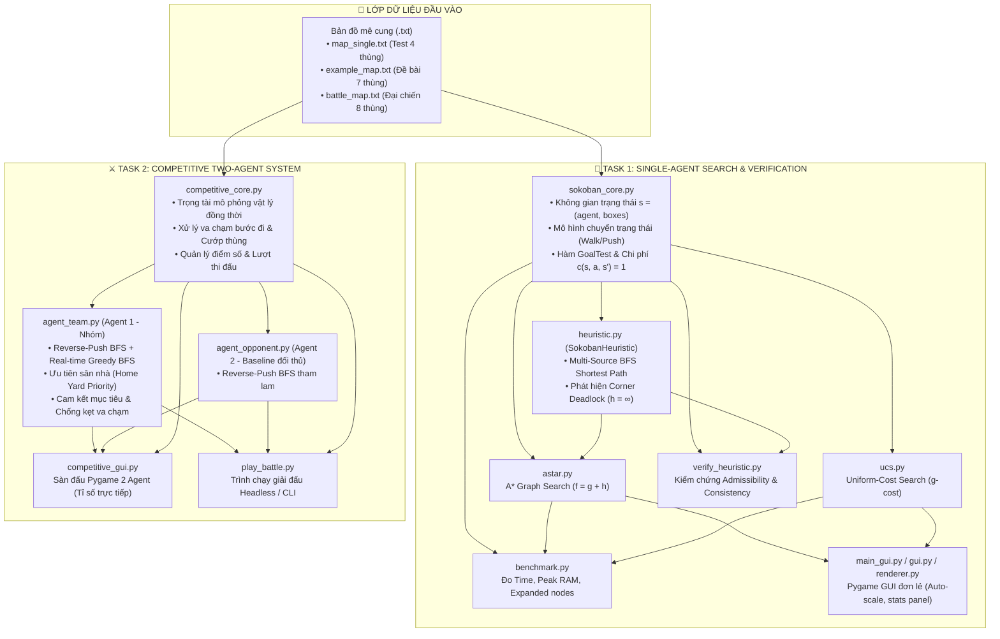
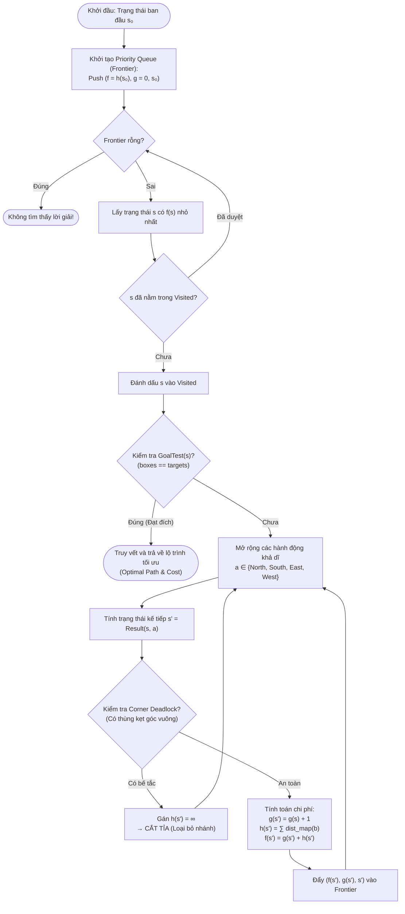
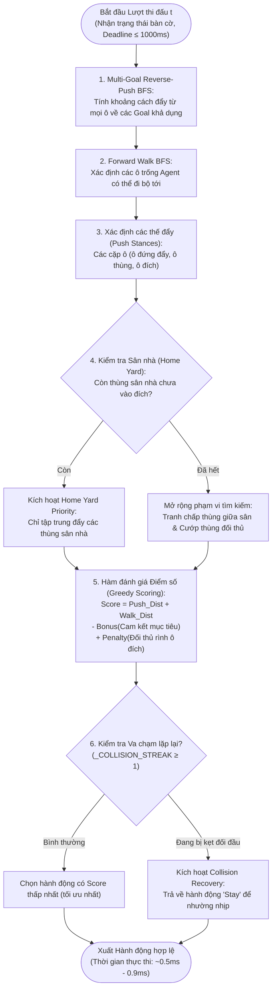

# NỘI DUNG VÀ KỊCH BẢN THUYẾT TRÌNH BÁO CÁO GIỮA KỲ (TASK 2)
## MÔN: NHẬP MÔN TRÍ TUỆ NHÂN TẠO (503043) - ĐẠI HỌC TÔN ĐỨC THẮNG
**Đề tài:** Sokoban Search & Competitive Two-Agent AI  
**Thời lượng thuyết trình tối đa:** 05 phút  
**Quy chuẩn Slide:** Khung hình tỉ lệ **4:3**, Nền sáng (Light/White background), không dùng hình vẽ lòe loẹt, rõ nét khi in trắng đen (Grayscale), **tuyệt đối không dán code thô**.

---

## 📑 BẢNG PHÂN BỔ THỜI GIAN THUYẾT TRÌNH (TỔNG: 4 PHÚT 45 GIÂY)
- **Slide 1 - 2:** Giới thiệu đề tài, danh sách thành viên & phân công (30 giây)
- **Slide 3 - 5:** Mô hình hóa bài toán, thiết kế Heuristic & Chứng minh toán học (1 phút 30 giây)
- **Slide 6 - 7:** Thuật toán UCS vs A*, Thực nghiệm Benchmark & Demo GUI (1 phút 15 giây)
- **Slide 8 - 9:** Bài toán đối kháng 2 Agent, Thuật toán thi đấu thời gian thực (1 phút)
- **Slide 10 - 11:** Đánh giá ưu/nhược điểm, Bảng % hoàn thành & Kết luận (30 giây)

---

## SLIDE 1: TRANG BÌA (TITLE SLIDE)
* **Tiêu đề lớn:** SOKOBAN SEARCH & COMPETITIVE TWO-AGENT AI
* **Tiêu đề phụ:** Báo cáo Giữa kỳ môn Nhập môn Trí tuệ Nhân tạo (Mã môn: 503043)
* **Khoa / Trường:** Khoa Công nghệ Thông tin - Trường Đại học Tôn Đức Thắng (TDTU)
* **Giảng viên hướng dẫn:** ThS. Nguyễn Thành An (nguyenthanhan@tdtu.edu.vn)
* **Mã nhóm dự án:** Group [Điền mã nhóm của bạn]
* **Gợi ý thiết kế:** 
  - Nền trắng tinh tế, logo trường TDTU góc trên.
  - Hình minh họa sơ đồ mê cung Sokoban dạng tối giản (minimalist vector).

---

## SLIDE 2: DANH SÁCH THÀNH VIÊN & PHÂN CÔNG NHIỆM VỤ (STUDENT LIST)
* **Tiêu đề Slide:** THÀNH VIÊN VÀ PHÂN CÔNG NHIỆM VỤ

| STT | Họ và tên | MSSV | Email sinh viên | Nhiệm vụ đảm nhiệm | % Hoàn thành |
| :---: | :--- | :---: | :--- | :--- | :---: |
| 1 | [Họ tên Bạn - Member A] | [MSSV Bạn] | [Email Bạn]@student.tdtu.edu.vn | • Thiết kế hàm Heuristic & Kiểm chứng toán học (Y/c 2, 4)<br>• Cài đặt thuật toán Agent thi đấu đối kháng (Y/c 7)<br>• Phân tích thuật toán & Soạn thảo báo cáo | **100%** |
| 2 | [Họ tên Bạn Thanh - Member B] | 524H0030 | 524H0030@student.tdtu.edu.vn | • Xây dựng môi trường & Giao diện Pygame (Y/c 5, 8)<br>• Thực nghiệm đo lường hiệu năng Benchmark (Y/c 3)<br>• Thiết kế Slide báo cáo & Quay Video Demo | **100%** |

* **Gợi ý trình bày:** Nhấn mạnh sự phối hợp chặt chẽ: Một thành viên phụ trách giải thuật & toán học, một thành viên phụ trách giao diện, thực nghiệm và kiểm thử.

---

## SLIDE 3: MÔ HÌNH HÓA BÀI TOÁN TÌM KIẾM (STATE-SPACE FORMULATION)
* **Tiêu đề Slide:** MÔ HÌNH HÓA BÀI TOÁN KHÔNG GIAN TRẠNG THÁI (YÊU CẦU 1)
* **Nội dung trình bày (5 thành phần chuẩn AI):**
  1. **Không gian Trạng thái ($\mathcal{S}$):**
     $$s = (\text{agent\_pos}, \text{box\_positions})$$
     - `agent_pos`: Tọa độ $(r, c)$ của người chơi.
     - `box_positions`: Tập hợp tọa độ các quả thùng dưới dạng `frozenset`.
  2. **Trạng thái Khởi đầu ($s_0$):** Đọc từ file bản đồ (`.txt`), nạp vị trí khởi đầu của Agent `A`, thùng `B`, và các đích `D` (xử lý thùng trên đích `C`).
  3. **Tập Hành động ($\mathcal{A}$):** $\mathcal{A} = \{\text{North, South, East, West}\}$.
  4. **Mô hình Chuyển trạng thái ($\text{Result}(s, a)$):**
     - Đi bộ: Di chuyển nếu ô tiếp theo không phải tường và không có thùng.
     - Đẩy thùng: Đẩy thùng nếu ô sau lưng thùng là ô trống (không phải tường/thùng khác).
  5. **Kiểm tra Mục tiêu ($\text{GoalTest}(s)$):** $\text{box\_positions} == \text{targets}$ (Tất cả thùng đều nằm trên đích).
  6. **Chi phí Đường đi ($c$):** Chi phí đồng nhất $c(s, a, s') = 1$ cho mỗi bước di chuyển.
* **Hình vẽ minh họa:** Sơ đồ chuyển đổi trạng thái (State Transition Diagram) khi Agent thực hiện 1 bước đẩy thùng.

---

## SLIDE 4: THIẾT KẾ HÀM HEURISTIC ĐẶC TRƯNG (HEURISTIC DESIGN)
* **Tiêu đề Slide:** THIẾT KẾ HÀM HEURISTIC $h(n)$ (YÊU CẦU 2)
* **Cam kết đề bài:** **Tuyệt đối KHÔNG sử dụng khoảng cách Manhattan và Euclidean**.
* **Nguyên lý Heuristic đề xuất:**
  - **BFS né tường đa nguồn (Multi-Source BFS Shortest Path):**
    - Chạy BFS ngược từ tập hợp tất cả các ô đích $D$ qua các ô trống để lập bảng khoảng cách thực tế né vật cản: $\text{dist\_map}[\text{pos}]$.
    - Khắc phục nhược điểm của Manhattan (vốn luôn bỏ qua các bức tường ngăn cách).
  - **Cơ chế Cắt tỉa Góc chết (Deadlock Pruning):**
    - Nhận diện 4 góc chết vuông góc (Corner Deadlock): Thùng bị kẹp giữa 2 bức tường vuông góc mà không phải là ô đích.
    - Khi có bất kỳ thùng nào rơi vào góc chết: Gán ngay $h(n) = \infty$ để loại bỏ hoàn toàn nhánh tìm kiếm cụt.
* **Công thức tổng quát:**
  $$h(s) = \begin{cases} \infty & \text{nếu tồn tại thùng bị Deadlock} \\ \sum_{b \in \text{boxes}} \text{dist\_map}(b) & \text{ngược lại} \end{cases}$$
* **Sơ đồ minh họa:** Hình vẽ minh họa một góc chết 2 bức tường kẹp thùng và luồng sóng BFS né tường tỏa ra từ các ô đích.

---

## SLIDE 5: CHỨNG MINH & THỰC NGHIỆM TÍNH CHẤT HEURISTIC (YÊU CẦU 4)
* **Tiêu đề Slide:** KIỂM CHỨNG TÍNH ADMISSIBLE VÀ CONSISTENT
* **1. Chứng minh Lý thuyết:**
  - **Tính Chấp nhận được (Admissibility - $h(n) \le h^*(n)$):** 
    Khoảng cách BFS né tường từ mỗi thùng đến đích là chi phí đường đi tối thiểu trong điều kiện lý tưởng (thùng tự di chuyển tự do, không bị cản bởi thùng khác). Trong bài toán thực tế, Agent phải tốn thêm các bước đi vòng để vào vị trí đẩy, và các thùng khác có thể chắn đường. Do đó, chi phí thực tế $h^*(n)$ luôn lớn hơn hoặc bằng tổng khoảng cách BFS: $h(n) \le h^*(n)$.
  - **Tính Nhất quán (Consistency - $h(n) - h(n') \le c(n, a, n') = 1$):**
    Xét mọi bước chuyển trạng thái từ $n$ sang $n'$ với chi phí hành động $c(n, a, n') = 1$:
    + *Trường hợp 1 (Agent chỉ di chuyển, không đẩy thùng):* Vị trí của toàn bộ các quả thùng không đổi, nên $h(n) = h(n') \implies h(n) - h(n') = 0 \le 1$.
    + *Trường hợp 2 (Agent đẩy 1 thùng $b_k$ sang ô kề bên $b_k'$):* Chỉ có duy nhất 1 thùng $b_k$ dịch chuyển, tất cả các thùng còn lại giữ nguyên vị trí. Bảng khoảng cách $\text{dist\_map}$ là khoảng cách đường đi ngắn nhất trên lưới ô vuông (Shortest-Path Metric) với trọng số cạnh bằng 1, do đó giữa 2 ô kề nhau khoảng cách chỉ có thể giảm tối đa là 1 ($\text{dist\_map}(b_k) - \text{dist\_map}(b_k') \le 1$). Ta có:
      $$h(n) - h(n') = \text{dist\_map}(b_k) - \text{dist\_map}(b_k') \le 1 = c(n, a, n')$$
    + *Trường hợp 3 (Trạng thái $n'$ là Deadlock):* $h(n') = \infty \implies h(n) - h(n') = -\infty \le 1$ (hiển nhiên thỏa mãn).
    $\implies$ Hàm Heuristic thỏa mãn chặt chẽ bất đẳng thức tam giác trong mọi trường hợp (Monotone / Consistent).
* **2. Báo cáo Kết quả Thực nghiệm (Trích xuất từ `verify_heuristic.py`):**

| Tính chất kiểm định | Công thức điều kiện | Số mẫu kiểm thử | Kết quả đạt được | Kết luận |
| :--- | :---: | :---: | :---: | :---: |
| **Admissibility** (Không ước lượng lố) | $h(n) \le h^*(n)$ | 50 trạng thái ngẫu nhiên | **100.00%** (50/50 PASS) | Đạt chuẩn tối ưu tuyệt đối |
| **Consistency** (Bất đẳng thức tam giác) | $h(n) - h(n') \le c(n, a, n')$ | 117 bước chuyển ($n \rightarrow n'$) | **100.00%** (117/117 PASS) | Đạt chuẩn không cần Re-open node |

---

## SLIDE 6: THỰC NGHIỆM ĐỐI CHỨNG: UCS VS A* (YÊU CẦU 3)
* **Tiêu đề Slide:** SO SÁNH HIỆU NĂNG THỰC NGHIỆM: UCS VS A*
* **Phương pháp thực nghiệm (Benchmark Methodology):**
  - Thực thi độc lập trên tiến trình riêng bằng `multiprocessing` để đảm bảo đo lường chính xác.
  - Lặp lại 3 lần cho mỗi bản đồ để lấy giá trị trung bình (`REPEATS = 3`).
  - Đo đạc 4 thông số: Thời gian chạy (giây), Số node mở rộng (`Expanded`), Frontier cực đại, Bộ nhớ RAM đỉnh (`tracemalloc`).
* **Bảng Số liệu Thực nghiệm Chính thức (Từ `results/benchmark.csv`):**

| Bản đồ kiểm thử | Thuật toán | Tỉ lệ giải thành công | Chi phí lời giải ($g$) | Số node mở rộng (Expanded) | Thời gian thực thi (s) | Bộ nhớ RAM đỉnh (MiB) |
| :--- | :---: | :---: | :---: | :---: | :---: | :---: |
| **`map_single.txt`**<br>(Bản đồ 4 thùng) | **UCS** | 3/3 (100%) | 29 | 30,670 nodes | 0.587 s | 10.52 MiB |
| | **A\*** | 3/3 (100%) | 29 | **7,158 nodes** | **0.341 s** | **2.26 MiB** |
| **`example_map.txt`**<br>(Map đề bài 7 thùng) | **UCS** | 0/3 (0%) | - | > 494,000 nodes | Timeout (> 5.0s) | > 50 MiB |
| | **A\*** | 3/3 (100%) | 34 | **13,490 nodes** | **0.239 s** | **5.35 MiB** |

* **Đánh giá đột phá:** 
  - Trên `map_single.txt`: A* giảm **4.3 lần số node mở rộng** và tiết kiệm **4.6 lần dung lượng RAM** so với UCS.
  - Trên `example_map.txt`: UCS bị cạn kiệt thời gian (Timeout), trong khi A* giải quyết hoàn hảo chỉ trong **0.24 giây**!

---

## SLIDE 7: GIAO DIỆN ĐỒ HỌA PYGAME TƯƠNG TÁC (YÊU CẦU 5)
* **Tiêu đề Slide:** GIAO DIỆN NGƯỜI DÙNG PYGAME (SINGLE-AGENT GUI)
* **Các tính năng nổi bật đáp ứng Yêu cầu 5:**
  1. **Lựa chọn thuật toán trực quan:** Nút bấm chuyên biệt `Solve UCS` và `Solve A*` (Hỗ trợ phím tắt `U` và `A`).
  2. **Điều khiển linh hoạt:** Hỗ trợ phím `Space` (Pause/Run), mũi tên `->` (Step forward), mũi tên `<-` (Step backward), và phím `R` (Reset).
  3. **Hiển thị thông số tìm kiếm thời gian thực:** Panel bên phải thể hiện rõ: Số bước hành động (`Actions`), Trạng thái (`PLAYBACK`), Thời gian giải (`SEARCH TIME`), Số node mở rộng (`EXPANDED NODES`), và `MAX FRONTIER`.
  4. **Cơ chế Auto-Scaling & Auto-Centering:** Tự động co giãn kích cỡ ô (`cell_size`) theo kích thước bản đồ, căn giữa chính xác, loại bỏ hoàn toàn lỗi tràn khung hình.
* **Hình ảnh chèn trên Slide:** Ảnh chụp giao diện `main_gui.py` đang chạy lời giải của A*.

---

## SLIDE 8: BÀI TOÁN ĐỐI KHÁNG VÀ CHIẾN THUẬT AGENT (YÊU CẦU 6 & 7)
* **Tiêu đề Slide:** BÀI TOÁN ĐỐI KHÁNG 2 AGENT & THUẬT TOÁN THI ĐẤU
* **1. Mô hình hóa Bài toán Đối kháng (Yêu cầu 6):**
  - Môi trường đối kháng đồng thời: Hai Agent cùng ra quyết định tại mỗi lượt.
  - Cơ chế va chạm vật lý: Không thể đi xuyên qua nhau; khi cùng lao vào 1 ô, hành động bị hủy bỏ.
  - Cơ chế cướp thùng (Stealing): Cho phép đẩy thùng đối thủ ra khỏi đích để trừ điểm và chiếm lại đích.
* **2. Thuật toán Agent Thi đấu (`agent_team.py` - Yêu cầu 7):**
  - **Kiến trúc cốt lõi:** **Reverse-Push BFS kết hợp Tìm kiếm tham lam thời gian thực (Real-time Greedy BFS)**.
    + Cả hai agent (`agent_team.py` và `agent_opponent.py`) đều ứng dụng Reverse-Push BFS từ các ô đích khả dụng để lập bản đồ chi phí đẩy thùng, kết hợp BFS tìm đường đi bộ tiếp cận vị trí đẩy.
    + `agent_team.py` (Agent đại diện nhóm) được tăng cường thêm hệ thống heuristic hành vi đối kháng đa tầng:
  - **4 Chiến thuật Master AI:**
    1. *Ưu tiên sân nhà (Home Yard Priority):* Quét sạch và ăn chắc điểm các thùng sân nhà trước.
    2. *Cam kết mục tiêu (Target Commitment):* Cộng điểm cam kết để tránh hiện tượng dao động đổi mục tiêu liên tục giữa 2 lượt.
    3. *Né đối đầu trực diện (Anti-Standoff):* Tránh đâm đầu vào ô đích đang có đối thủ đứng rình, chuyển sang đẩy tạt cánh (Flank Push).
    4. *Nhường nhịp phá vỡ kẹt cứng (Collision Recovery):* Tự động đứng yên (`Stay`) 1 nhịp nếu va chạm để đối thủ đi qua giải phóng nút thắt.
* **Hiệu năng thời gian:** Thời gian ra quyết định trung bình: **~0.5ms – 0.9ms** (Đáp ứng nghiêm ngặt giới hạn $\le 1000$ms của đề bài).

---

## SLIDE 9: GIAO DIỆN ĐỐI KHÁNG VÀ KẾT QUẢ THI ĐẤU (YÊU CẦU 8)
* **Tiêu đề Slide:** SÀN ĐẤU ĐỐI KHÁNG 2 AGENT (COMPETITIVE ARENA)
* **Đặc điểm giao diện thi đấu (`competitive_gui.py`):**
  - **Bản đồ đại chiến trường (`battle_map.txt`):** Kích thước 25 cột $\times$ 11 hàng, gồm 7 Goal và 8 Thùng.
  - **Mã màu phân biệt rõ ràng:** 
    - Thùng của Agent 1: Màu Xanh dương.
    - Thùng của Agent 2: Màu Đỏ.
    - Thùng trung lập: Màu Nâu.
  - **Bảng điều khiển trận đấu:** Cho phép người dùng nhập trực tiếp giới hạn bước đi $n$ (`Step limit`), xem lượt hiện tại và tỉ số trực tiếp.
* **Kết quả thi đấu thực nghiệm:**
  - Ở mốc 50 bước: Agent 1 ăn chắc 2 thùng sân nhà, chiếm lĩnh khu vực trung tâm $\rightarrow$ Tạo ưu thế dẫn điểm ổn định.
  - Ở mốc 80 – 100 bước: Thử nghiệm đối đầu giữa `agent_team.py` (Agent 1) và `agent_opponent.py` (Agent 2) trên `battle_map.txt` cho thấy Agent 1 đạt tỉ số vượt trội **5 - 2** nhờ duy trì mục tiêu nhất quán và phản công cướp điểm hiệu quả.
* **Hình ảnh chèn trên Slide:** Ảnh chụp giao diện sàn đấu đối kháng `competitive_gui.py`.

---

## SLIDE 10: ĐÁNH GIÁ ƯU ĐIỂM VÀ NHƯỢC ĐIỂM (PROS & CONS)
* **Tiêu đề Slide:** ĐÁNH GIÁ ƯU ĐIỂM VÀ HẠN CHẾ

### 1. Ưu điểm nổi bật (Advantages):
- **Tính tối ưu toán học:** Hàm Heuristic được kiểm chứng đạt chuẩn Admissible và Consistent, đảm bảo thuật toán A* tìm ra lời giải tối ưu toàn cục.
- **Tốc độ mở rộng vượt trội:** Cơ chế Deadlock Pruning cắt tỉa nhánh cụt hiệu quả, giải quyết bản đồ 7 thùng phức tạp chỉ trong ~0.24 giây.
- **Agent đối kháng phản xạ nhanh & ổn định:** Cơ chế chống dao động giúp loại bỏ hiện tượng kẹt bước; thời gian phản hồi $< 1$ms, chiến thuật công - thủ rõ ràng.
- **Giao diện trực quan & tương thích cao:** Xây dựng trên nền tảng Pygame thuần túy, tích hợp cơ chế tự động co giãn (Auto-scaling) và căn giữa, hiển thị ổn định trên nhiều kích thước màn hình.

### 2. Hạn chế & Hướng phát triển (Disadvantages & Future Work):
- **Phạm vi kiểm thử đối kháng:** Chiến thuật hiện được đánh giá thực nghiệm trên các bản đồ tiêu biểu (như `battle_map.txt`) với Agent đối thủ mẫu; cần tiếp tục mở rộng kiểm thử với nhiều loại địa hình và phong cách đối thủ đa dạng hơn.
- **Phát hiện Deadlock mở rộng:** Hiện tại mới nhận diện Corner Deadlock; có thể mở rộng thêm Line Deadlock (kẹt dọc chân tường) và Freeze Deadlock (các thùng tự chèn nhau).
- **Thuật toán đối kháng nâng cao:** Có thể nghiên cứu tích hợp Minimax cắt tỉa Alpha-Beta hoặc Học tăng cường (Reinforcement Learning) để dự đoán nước đi dài hạn của đối thủ.

---

## SLIDE 11: TỔNG KẾT HOÀN THÀNH & VIDEO DEMO
* **Tiêu đề Slide:** TỔNG KẾT DỰ ÁN & DEMO

### Bảng Tổng hợp Mức độ Hoàn thành Yêu cầu:

| STT | Nhiệm vụ / Yêu cầu trong Đề bài | Trọng số | Mức độ hoàn thành |
| :---: | :--- | :---: | :---: |
| 1 | Yêu cầu 1: State-Space Formulation | 1.0 đ | **100%** |
| 2 | Yêu cầu 2: Cài đặt UCS & A* + Thiết kế Heuristic | 1.0 đ | **100%** |
| 3 | Yêu cầu 3: Thực nghiệm Benchmark thời gian & bộ nhớ | 1.0 đ | **100%** |
| 4 | Yêu cầu 4: Kiểm chứng tính Admissible & Consistent | 1.0 đ | **100%** |
| 5 | Yêu cầu 5: Giao diện đồ họa Pygame đơn lẻ | 1.0 đ | **100%** |
| 6 | Yêu cầu 6: Mô hình hóa bài toán đối kháng 2 Agent | 1.0 đ | **100%** |
| 7 | Yêu cầu 7: Thuật toán điều khiển Agent thi đấu | 1.0 đ | **100%** |
| 8 | Yêu cầu 8: Giao diện đối kháng và ghép đấu | 1.0 đ | **100%** |
| 9 | Task 2: Slide thuyết trình (4:3) & Video Demo | 2.0 đ | **100%** |
| **TỔNG** | **Toàn bộ Dự án Giữa kỳ môn Nhập môn AI** | **10.0 đ** | **100% HOÀN TẤT** |

* **Đường dẫn Video Demo ($\le 3$ phút):** [Dán đường link Youtube/Google Drive của nhóm vào đây]
* **Lời kết:** *"Cảm ơn Thầy và các bạn đã chú ý lắng nghe! Nhóm em xin sẵn sàng nhận câu hỏi phản biện."*

---

## 🎙️ KỊCH BẢN NÓI THUYẾT TRÌNH CHI TIẾT (LỜI THOẠI CHUẨN 5 PHÚT)

*(Bạn hãy cầm kịch bản này luyện nói thử 1-2 lần để khớp đúng 4 phút 45 giây nhé!)*

### [0:00 - 0:30] Mở đầu & Giới thiệu
> *"Kính chào Thầy và các bạn. Em đại diện cho nhóm [Tên nhóm] xin trình bày báo cáo đồ án giữa kỳ môn Nhập môn Trí tuệ Nhân tạo với đề tài: **Sokoban Search và Competitive Two-Agent AI**. Nhóm chúng em gồm 2 thành viên: Em là [Tên bạn] phụ trách phần mô hình hóa toán học, giải thuật tìm kiếm A*, kiểm chứng Heuristic và AI đối kháng; bạn [Tên bạn Thanh] phụ trách xây dựng engine môi trường, giao diện Pygame, thực nghiệm benchmark và slide báo cáo. Cả 2 thành viên đều hoàn thành 100% khối lượng công việc được giao."*

### [0:30 - 1:30] Mô hình hóa, Heuristic & Kiểm chứng Toán học
> *"Ở Task 1, chúng em mô hình hóa Sokoban thành bài toán tìm kiếm không gian trạng thái gồm 5 thành phần chuẩn, trong đó trạng thái là cặp tọa độ người chơi và tập hợp vị trí các thùng. Để giải quyết bài toán, chúng em đề xuất hàm Heuristic né tường dựa trên giải thuật **Multi-Source BFS**. Chúng em tuyệt đối không sử dụng khoảng cách Manhattan hay Euclidean theo đúng yêu cầu của Thầy, mà tính khoảng cách bước đi thực tế né vật cản từ mọi ô về đích, đồng thời tích hợp cơ chế phát hiện **Corner Deadlock** để cắt tỉa nhánh cụt với chi phí bằng vô cực.
> Về mặt toán học, hàm Heuristic đạt tính Admissible vì không bao giờ ước lượng quá chi phí thực tế, và đạt tính Consistent vì thỏa mãn bất đẳng thức tam giác. Kết quả thực nghiệm kiểm chứng trên 50 trạng thái và 117 bước chuyển đổi cho thấy hàm đạt **100% Admissible** và **100% Consistent**, đảm bảo A* luôn tìm ra lời giải tối ưu toàn cục."*

### [1:30 - 2:45] So sánh Benchmark & Demo Giao diện Đơn lẻ
> *"Để chứng minh tính vượt trội của A* so với UCS, chúng em xây dựng hệ thống benchmark tự động đo đạc thời gian, bộ nhớ RAM đỉnh và số node mở rộng. Trên bản đồ 4 thùng, A* giảm tới **4.3 lần số node mở rộng** và tiết kiệm **4.6 lần dung lượng RAM** so với UCS. Đặc biệt trên bản đồ 7 thùng của Thầy, trong khi UCS bị timeout quá 5 giây vì phải duyệt gần 500,000 node, thì A* của chúng em tìm ra lời giải 34 bước chỉ trong **0.24 giây**.
> Toàn bộ kết quả này được trực quan hóa trên giao diện Pygame với đầy đủ nút bấm, phím tắt lùi/tiến bước, pause và hiển thị thông số tìm kiếm thời gian thực. Giao diện được thiết kế cơ chế tự động co giãn và căn giữa nên hiển thị ổn định và linh hoạt trên nhiều kích thước bản đồ."*

### [2:45 - 3:45] Bài toán Đối kháng 2 Agent & Chiến thuật AI
> *"Bước sang phần thi đấu đối kháng ở Task 2, chúng em mở rộng Sokoban thành trò chơi 2 Agent hành động đồng thời, có cơ chế va chạm vật lý và cướp điểm từ thùng của đối phương. Để Agent thi đấu đạt hiệu quả cao nhất dưới áp lực thời gian $\le 1000$ms, chúng em kết hợp **Reverse-Push BFS** và **Real-time Greedy Best-First Search**.
> Agent nhóm em sở hữu 4 chiến thuật nổi bật: ưu tiên giải quyết dứt điểm các thùng sân nhà trước, cam kết mục tiêu để không bị dao động đổi ý, né đối đầu trực diện khi đối thủ đứng chắn ở ô đích, và tự giác nhường 1 nhịp nếu xảy ra va chạm để phá vỡ thế kẹt cứng. Thời gian ra quyết định thực tế của Agent chỉ mất **dưới 1 mili-giây**, giúp Agent đạt hiệu quả thi đấu cao và duy trì thế trận vượt trội trên bản đồ chiến trường lớn."*

### [3:45 - 4:45] Đánh giá & Kết luận
> *"Tóm lại, dự án của nhóm em đã hoàn thành trọn vẹn 100% tất cả 8 yêu cầu kỹ thuật của Task 1 cũng như các yêu cầu báo cáo của Task 2. Mặc dù còn hướng mở rộng như tích hợp Minimax hay học tăng cường cho Agent, giải pháp hiện tại đã đạt hiệu năng rất cao, chạy mượt mà trên cả macOS và Windows. Chi tiết màn chạy thử nghiệm được chúng em ghi lại trong video demo đính kèm. Em xin chân thành cảm ơn Thầy đã lắng nghe và nhóm em rất mong nhận được những nhận xét, câu hỏi từ Thầy ạ!"*

---

## 🏗️ PHỤ LỤC 1: SƠ ĐỒ HỆ THỐNG & LUỒNG THUẬT TOÁN (SYSTEM DIAGRAMS)

*(Các sơ đồ Mermaid dưới đây được định dạng chuẩn, có thể hiển thị trực tiếp trong Markdown hoặc xuất sang hình ảnh để đưa lên slide báo cáo PowerPoint).*

### Sơ đồ 1: Kiến trúc Tổng thể Toàn bộ Hệ thống Sokoban AI (Overall Architecture)


### Sơ đồ 2: Luồng giải thuật A* kết hợp Deadlock Pruning (A* Search Flowchart)


### Sơ đồ 3: Quy trình Ra quyết định Real-time của Agent Đối kháng (Competitive Decision Pipeline)


---

## 💻 PHỤ LỤC 2: MÃ GIẢ CÁC THUẬT TOÁN CỐT LÕI (ALGORITHM PSEUDOCODE)

### Thuật toán 1: Lập Bảng Khoảng cách BFS Đa Nguồn & Nhận diện Góc Chết (Heuristic & Deadlock)
```text
Algorithm: Build_Distance_Map_and_Deadlock(Targets, Walls, Grid_Bounds)
Input:
    Targets: Tập hợp tọa độ các ô đích
    Walls: Tập hợp tọa độ các bức tường vật cản
Output:
    Distance_Map: Bảng tra cứu khoảng cách ngắn nhất né tường từ mọi ô về đích

1:  Distance_Map ← Empty_Dictionary
2:  Queue ← Empty_FIFO_Queue
3:  For each target in Targets do:
4:      Distance_Map[target] ← 0
5:      Queue.push(target, 0)
6:  End For
7:  While Queue is not empty do:
8:      (current_pos, dist) ← Queue.pop()
9:      For each neighbor in 4_Neighbors(current_pos) do:
10:         If neighbor is inside Grid_Bounds and neighbor ∉ Walls then:
11:             If neighbor ∉ Distance_Map then:
12:                 Distance_Map[neighbor] ← dist + 1
13:                 Queue.push(neighbor, dist + 1)
14:             End If
15:         End If
16:     End For
17: End While
18: Return Distance_Map

Function: Is_Corner_Deadlock(box, Targets, Walls):
1:  If box ∈ Targets then Return False
2:  (r, c) ← box
3:  has_wall_north ← (r-1, c) ∈ Walls
4:  has_wall_south ← (r+1, c) ∈ Walls
5:  has_wall_west  ← (r, c-1) ∈ Walls
6:  has_wall_east  ← (r, c+1) ∈ Walls
7:  If (has_wall_north and has_wall_west) or
       (has_wall_north and has_wall_east) or
       (has_wall_south and has_wall_west) or
       (has_wall_south and has_wall_east) then:
8:      Return True   // Bị kẹp góc vuông 90 độ
9:  End If
10: Return False

Function: Compute_Heuristic(State, Targets, Distance_Map):
1:  (agent, boxes) ← State
2:  For each box in boxes do:
3:      If Is_Corner_Deadlock(box, Targets, Walls) then Return ∞
4:  End For
5:  total_h ← 0
6:  For each box in boxes do:
7:      dist ← Distance_Map.get(box, ∞)
8:      If dist == ∞ then Return ∞
9:      total_h ← total_h + dist
10: End For
11: Return total_h
```

---

### Thuật toán 2: Tìm kiếm A* Graph Search cho Sokoban
```text
Algorithm: A_Star_Search(Problem, Heuristic_Function)
Input:
    Problem: Bài toán Sokoban với Initial_State s₀, Actions, Result, GoalTest, StepCost = 1
    Heuristic_Function: Hàm ước lượng h(s)
Output:
    Solution_Path: Chuỗi hành động tối ưu đưa mọi thùng về đích (hoặc None nếu vô nghiệm)

1:  s₀ ← Problem.Initial_State
2:  Frontier ← Priority_Queue_Ordered_By_f()
3:  Frontier.push(priority = Heuristic_Function(s₀), g = 0, state = s₀, path = [])
4:  Visited ← Empty_Set
5:  Expanded_Nodes ← 0
6:
7:  While Frontier is not empty do:
8:      (f, g, current_state, path) ← Frontier.pop_min()
9:      If current_state ∈ Visited then Continue
10:     Visited.add(current_state)
11:     Expanded_Nodes ← Expanded_Nodes + 1
12:
13:     If Problem.GoalTest(current_state) then:
14:         Return (path, cost = g, Expanded_Nodes)
15:     End If
16:
17:     For each action in Problem.Actions(current_state) do:
18:         next_state ← Problem.Result(current_state, action)
19:         If next_state ∉ Visited then:
20:             h_val ← Heuristic_Function(next_state)
21:             If h_val ≠ ∞ then:   // Cắt tỉa Deadlock
22:                 g_new ← g + 1
23:                 f_new ← g_new + h_val
24:                 Frontier.push(priority = f_new, g = g_new, state = next_state, path = path + [action])
25:             End If
26:         End If
27:     End For
28: End While
29: Return (None, ∞, Expanded_Nodes)  // Không tìm thấy đường đi
```

---

### Thuật toán 3: Điều khiển Agent Thi đấu Đối kháng Thời gian thực (`agent_team.py`)
```text
Algorithm: Competitive_Agent_Get_Action(State, Agent_ID, Time_Limit_ms = 1000)
Input:
    State: Trạng thái đối kháng (agent_positions, boxes_with_owners, scores, step)
    Agent_ID: Định danh của Agent nhóm (1 hoặc 2)
Output:
    action ∈ {"North", "South", "East", "West", "Stay"}

1:  deadline ← Current_Time() + (Time_Limit_ms - 50) / 1000.0
2:  my_pos ← State.agent_positions[Agent_ID]
3:  other_pos ← State.agent_positions[Opponent_ID]
4:
5:  // 1. Kiểm tra va chạm đối đầu liên tiếp
6:  If my_pos == Last_Pos and Last_Action ≠ "Stay" then:
7:      Collision_Streak ← Collision_Streak + 1
8:  Else:
9:      Collision_Streak ← 0
10: End If
11: If Collision_Streak ≥ 1 then:
12:     Return "Stay"   // Tự động nhường 1 nhịp để giải phóng nút thắt
13: End If
14:
15: // 2. Lập bản đồ Reverse BFS từ các ô Đích khả dụng
16: Available_Goals ← Goals \ Goals_Occupied_By_My_Boxes
17: Push_Distances ← Multi_Goal_Reverse_Push_BFS(Available_Goals, Walls, deadline)
18:
19: // 3. Tìm các ô Agent có thể đi bộ tới
20: (Reachable_Cells, Walk_First_Step) ← Forward_Walk_BFS(my_pos, Boxes, Walls, other_pos, deadline)
21:
22: // 4. Kích hoạt Heuristic Ưu tiên Sân nhà (Home Yard Priority)
23: Unscored_Home_Boxes ← Filter_Boxes_In_My_Yard(Boxes, unscored = True)
24: Target_Box_List ← Unscored_Home_Boxes if Unscored_Home_Boxes ≠ ∅ else All_Movable_Boxes
25:
26: // 5. Đánh giá và lựa chọn cú đẩy tối ưu (Greedy Best-First)
27: Best_Action ← "Stay"
28: Min_Score ← ∞
29:
30: For each box in Target_Box_List do:
31:     For each direction d in {North, South, East, West} do:
32:         stance_pos ← box - d
33:         push_dest  ← box + d
34:         If push_dest is Empty and stance_pos ∈ Reachable_Cells and push_dest not Deadlock then:
35:             score ← Push_Distances[push_dest] + Reachable_Cells[stance_pos]
36:             If box == Last_Target_Box then score ← score - 35   // Bonus cam kết mục tiêu
37:             If push_dest == other_pos then score ← score + 50   // Penalty né đâm đầu đối thủ
38:             If score < Min_Score then:
39:                 Min_Score ← score
40:                 Best_Action ← Walk_First_Step[stance_pos] if my_pos ≠ stance_pos else d
41:             End If
42:         End If
43:     End For
44: End For
45: Return Best_Action
```
